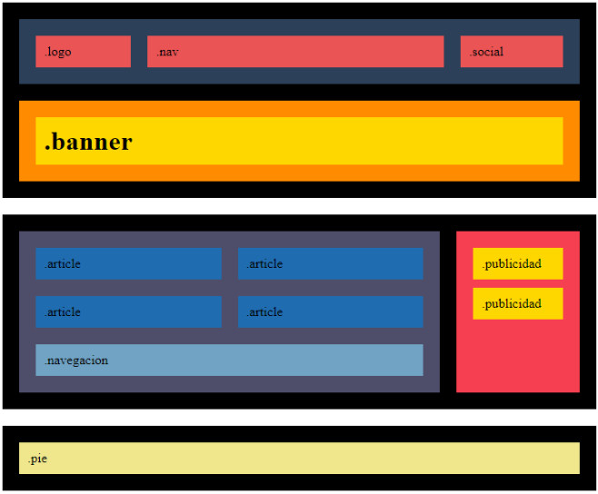
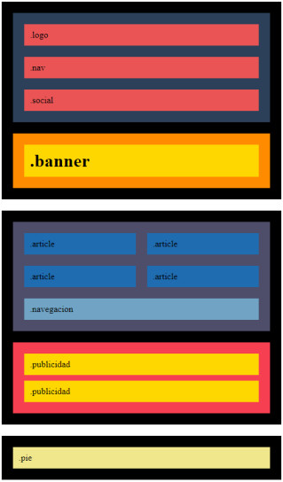
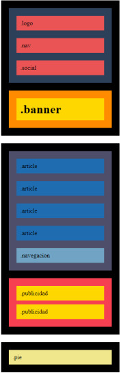

# Descripción

En aquesta pràctica hauràs de fer un Layout que ha de funcionar tant en escriptori, com mòbil i tauleta.

Tingues en compte les següents consideracions. Són errors habituals en els lliuraments:

- En general, mai li posem height a una capa, sinó que deixem que la capa s'adapti al seu contingut (si la capa no té contingut, li pots posar un height).
- La pàgina no hauria de tenir barra de scroll horitzontal (si et passa, hauràs d'esbrinar inspeccionant la pàgina quin bloc és més ample que la pantalla del navegador).
- Dins d'un div sol haver-hi altres divs. Els divs tenen display:block per defecte. Això fa que es vagin col·locant de manera vertical. Per tant, sovint no és necessari especificar els següents estils per a un element per ser una cosa redundant:
  .element{ display:flex; flex-direction:column }
- En un div, per defecte l'ample és de la totalitat de la capa que embolica, així que normalment no serà necessari especificar width:100%

## ✔️	 Nivel 1

### Ejercicio 1

A partir del wireframe que t'aportem en format .png, hauràs de fer la maquetació en format escriptori. És indiferent els colors escollits, però sí que és molt important que facis l'estructura de caixes que t'indiquem.



### Ejercicio 2

S'ha de començar a preparar l'adaptació a diferents dispositius, i per això has de tenir clar el concepte de Media Query. Fixa't que hi ha canvi de distribució i color d'alguns elements.
Seguint amb el projecte anterior, fes la versió per tauleta, tal com indica la captura següent:



### Ejercicio 3

Com el cas anterior, ara hauràs de fer l'adaptació a versió Mobile.



## ✔️	 Nivel 2

Ens demana crear una p'agina web completa.

### Referencias para los ejercicios 4 i 5

A continuació tens una mostra de com quedaria la maquetació final de la pàgina.


### Ejercicio 4

En aquesta part volem que treballis la capçalera i el grafisme. Hauràs d'afegir icones i logotip, a més de fer una imatge de fons. Substitueix els quadrants respectius perquè la nova capçalera tingui l'aspecte d'aquest web de turisme al japó.

És important que tinguis en consideració el següent:

- Les opcions clicables han de tenir efecte roll-over.
- Els media query creats a l'activitat anterior, s'han de mantenir.
- El text "Disfruta..." és semitransparent.
- El logo i el fons de la capçalera, els tens adjuntats a l'activitat. La resta d'elements gràfics els hauràs de cercar i que siguin tan semblants com sigui possible.
- Les icones del menú pots obtenir-les de ->font-awesome.

### Ejercicio 5

En aquest exercici hauràs d'afegir l'apartat dels articles

## ✔️	 Nivel 3

### Ejercicio 6

ENHORABONA! Has creat una web completa, però com pots observar, és molt estàtica. Per millorar l'experiència d'usuari, aplica sobre els elements principals de la web, títol i logo, una animació usant keyframes.

### Ejercicio 7

Et veus capaç de fer el mateix treball però amb grid layout? Doncs l'objectiu d'aquest treball és que utilitzis les propietats de grid layout per fer tota l'estructura de la web i els seus diferents dispositius (sempre amb Media Query).

Si vols pots consultar el material opcional de grid layout que hi ha al campus.

## 💻 Tecnologías Utilizadas

- PHP 7.4 o superior
- Servidor web (Apache, Nginx, etc.) o el servidor web integrado de PHP

## 🔑 Requisitos


## ☕ Instalación
1. Clona el repositorio en tu máquina local:
   ```sh
   git clone https://github.com/soughtsingularity/Sprint-1/tree/main/Entrega_6_PHP_Avanzado

2. Navega al directorio del proyecto:

```cd tu_repositorio```

## ⏩ Ejecución

1. Navega al direcorio del proyecto

```cd_tu_repositorio```

2. Inicia la web clickando en el archivo.html


