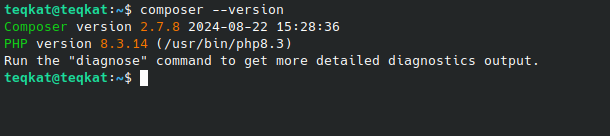
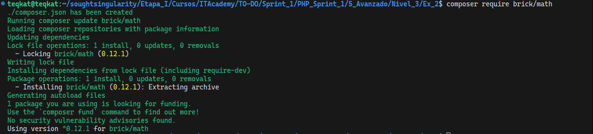

## Ya tenia composer instalado. Fue necesario para hacer los ejercicios de testing, ya que utilice PHPUnit, de todas formas, dejo los comandos necesarios para su instalacion en Linux

``curl -sS https://getcomposer.org/installer | php``

- curl -sS https://getcomposer.org/installer
  Descarga el script de instalación de Composer desde su sitio oficial.
- | php
  Ejecuta el script descargado con PHP.

Este comando descarga el archivo composer.phar (el binario de Composer) en el directorio actual.
No lo instala como un comando global, lo que significa que solo podrás ejecutarlo desde donde se descargó utilizando php composer.phar, para poder usar Composer de forma global usaremos el siguiente comando:

`` sudo mv composer.phar /usr/local/bin/composer``

Aquí dejo una captura de pantalla de mi versión de composer instalada

## Voy a instalar la librería Brick/Math para crear un programa que dado un planeta, nos mida la distancia en pasos, estableciendo un valor de  40 cm, que es la media que ChatGPT dice que tiene un paso

Para instalar la librería, que instalaremos en el fichero en el que vamos a trabajar y no de forma global, usaremos el siguiente comando:

``composer require brick/math``

